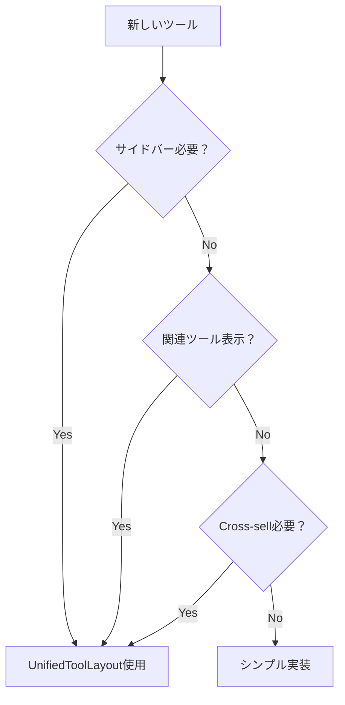

# UnifiedToolLayout 使用ガイド

## 📋 概要
UnifiedToolLayoutは、ツール間で一貫したUIを提供するための共通レイアウトコンポーネントです。

## 🏗️ アーキテクチャ

```
app/tools/layout.tsx
  ├─ Header（共通ヘッダー）
  ├─ パンくずリスト
  ├─ 背景エフェクト
  └─ [ツールページ]
       └─ UnifiedToolLayout
            ├─ ツールタイトル
            ├─ メインコンテンツ（children）
            ├─ サイドバー（オプション）
            ├─ 関連ツール
            └─ Cross-sell

```

## ✅ 使用判断フローチャート



## 🔧 実装パターン

### パターン1: フル機能（推奨）
```typescript
// app/tools/[tool-name]/components/ToolComponent.tsx
import UnifiedToolLayout from '@/components/common/UnifiedToolLayout'

export default function ToolComponent() {
  return (
    <UnifiedToolLayout
      toolId="tool-name"
      showCrossSell={true}
      showToolInfo={true}
      showSidebar={true}
    >
      {/* ツール固有のコンテンツ */}
    </UnifiedToolLayout>
  )
}
```

### パターン2: サイドバーなし
```typescript
<UnifiedToolLayout
  toolId="tool-name"
  showCrossSell={true}
  showToolInfo={false}
  showSidebar={false}
>
  {/* シンプルなツールコンテンツ */}
</UnifiedToolLayout>
```

### パターン3: シンプル実装（UnifiedToolLayoutなし）
```typescript
// 直接実装（pdf-tools, code-readerなど複雑なツール向け）
export default function SimpleToolComponent() {
  return (
    <div className="container mx-auto px-4 py-8">
      <h1 className="text-3xl font-bold text-white mb-4">
        Tool Name
      </h1>
      <div className="bg-white/5 backdrop-blur-xl rounded-2xl p-6">
        {/* コンテンツ */}
      </div>
    </div>
  )
}
```

## 📊 ツール別推奨設定

| ツール | UnifiedToolLayout | サイドバー | Cross-sell | 理由 |
|--------|------------------|------------|------------|------|
| ai-summarizer | ✅ | ✅ | ✅ | 関連情報が多い |
| ai-dev-dictionary | ✅ | ✅ | ✅ | カテゴリ情報表示 |
| stack-recommender | ✅ | ✅ | ✅ | 推奨情報が豊富 |
| text-case | ⚠️ | ❌ | ✅ | シンプルツール |
| json-format | ⚠️ | ❌ | ✅ | 単機能ツール |
| pdf-tools | ❌ | - | - | 独自レイアウト必要 |
| code-reader | ❌ | - | - | 複雑なUI |
| blurtap | ❌ | - | - | ビジュアル特化 |

## 🎨 カスタマイズオプション

### Container Width
```typescript
containerWidth="xl"    // デフォルト（max-w-7xl）
containerWidth="2xl"   // 広いツール用（max-w-[1600px]）
containerWidth="full"  // 全画面ツール用
```

### 条件付き表示
```typescript
const [showDetails, setShowDetails] = useState(false)

return (
  <UnifiedToolLayout
    showSidebar={showDetails}  // 動的に切り替え
    toolId="tool-name"
  >
    {/* コンテンツ */}
  </UnifiedToolLayout>
)
```

## 🚨 注意事項

### DO ✅
- categories.config.tsにツール情報を正しく登録
- toolIdは実際のURLパスと一致させる
- レスポンシブデザインをテスト

### DON'T ❌
- app/tools/layout.tsxと機能を重複させない
- HeaderやFooterを二重に表示しない
- パンくずリストを独自実装しない

## 📝 チェックリスト

- [ ] categories.config.tsにツール登録済み
- [ ] toolIdが正しく設定されている
- [ ] インポートパスが正しい（@/components/common/UnifiedToolLayout）
- [ ] 不要なpropsを削除（showHeader, showFooter, showBreadcrumb）
- [ ] モバイル表示をテスト
- [ ] サイドバーの開閉動作確認

## 🔄 マイグレーション手順

### 既存ツールをUnifiedToolLayoutに移行

1. **現状確認**
```bash
# ツールの現在の構造を確認
ls -la app/tools/[tool-name]/
```

2. **コンポーネント作成/更新**
```typescript
// app/tools/[tool-name]/components/ToolComponent.tsx
import UnifiedToolLayout from '@/components/common/UnifiedToolLayout'

// 既存のコンテンツをUnifiedToolLayoutでラップ
```

3. **page.tsxを更新**
```typescript
// app/tools/[tool-name]/page.tsx
import ToolComponent from './components/ToolComponent'

export default function ToolPage() {
  return <ToolComponent />
}
```

4. **テスト**
- デスクトップ表示
- モバイル表示
- サイドバー動作
- Cross-sell表示

## 🎯 ベストプラクティス（更新版）

1. **新規ツール作成時**
   - シンプル実装から始める
   - PeopleAlsoUseを直接使用
   - 必要に応じて機能追加

2. **UnifiedToolLayoutの使用基準**
   - 複数の関連機能が必要
   - 特殊なレイアウト要件
   - 他の方法では実装困難な場合のみ

3. **パフォーマンス最適化**
   - 不要な階層を避ける
   - 動的インポートを活用
   - シンプルな構造を維持

## 📚 参考実装

### シンプル実装の成功例
- `app/tools/ai-summarizer` - シンプル実装に移行
- `app/tools/text-case` - 最小限の構造
- `app/tools/json-format` - 単機能ツール

### 独自実装例
- `app/tools/pdf-tools` - 複雑なUI要件
- `app/tools/code-reader` - 特殊レイアウト

---

## 🔄 更新履歴

| バージョン | 日付 | 内容 |
|-----------|------|------|
| 1.0.0 | 2025-01-XX | 初版作成 |
| 2.0.0 | 2025-01-XX | シンプル実装を推奨に変更 |
| 2.1.0 | 2025-01-XX | 実装例と注意事項を更新 |

---

最終更新: 2025年1月
バージョン: 2.1.0